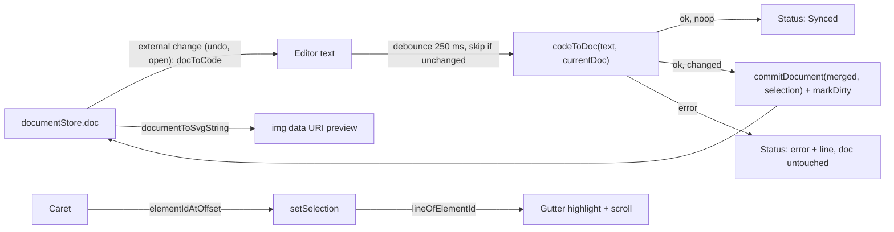

# Live SVG Code mode — revised build plan

Revision of `plans/live_svg_code_mode_4373a5d0.plan.md` after an architecture and implementation review. The original approach (a third workspace mode, a plain `<textarea>` editor, reuse of `documentToSvgString` / `svgStringToDocument`, debounced commits through `commitDocument`, and an `` preview) is kept. The revision fixes the places where the original plan assumed the serialize → deserialize round trip is lossless (it is not) and pins down implementation details that were left open.

Read **Section 1 (facts about the codebase)** before touching any file. Every later step relies on them.

---

## 0. Scope

**In scope**

- `AppMode` gains `"code"`. A third `Code` tab appears in the toolbar next to Convert / Edit, plus an "Edit SVG code" command in the palette.
- `CodeView` = `SplitPane` with a code editor (left) and a live preview (right).
- Two-way sync: text → document (debounced, undoable) and document → text (on undo/redo/file open).
- Status strip: Synced / parse error with line + "Go to line" / "Not supported, removed" warning / byte count.
- Stable node ids across edits (`preserveIds`), so selection and names survive.
- Linked selection: caret → canvas selection, canvas selection → highlighted line.
- Prettify, Minify, Round numbers toolbar with byte stats.
- Everything the canvas holds that SVG text cannot express (effects, clip masks, lock state, blend mode, image bytes, symbol contents, artboards, …) is **carried over** from the current document on every commit instead of being destroyed.

**Out of scope (documented limitations, not bugs)**

- Editing artboards, effects, clip masks, image contents, or symbol definitions through the code. They are read-only in Code mode and are kept from the canvas.
- Syntax highlighting / CodeMirror.
- Web fonts in the preview (`` cannot load page fonts, so `DM Sans Variable` text renders in a fallback font there).

No new dependencies.

---

## 1. Facts about the codebase that the implementation depends on

| # | Fact | Where | Consequence |
|---|------|-------|-------------|
| F1 | `commitDocument(doc, selection = [])` **clears the selection** unless you pass one. It also runs `normalizeDoc` (a `structuredClone`), so the object stored is **not** the object you passed. | `src/shared/stores/documentStore.ts` lines 120–134 | Always pass the current selection. After committing, read `useDocumentStore.getState().doc` to learn the stored reference for echo suppression. |
| F2 | `commitDocument` treats the change as a no-op when `projectContents(current) === projectContents(next)`, i.e. `JSON.stringify(doc, null, 2)` equality. That is **key-order sensitive**. | same | Do not rely on it for no-op detection. Use canonical SVG equality (Section 3.3). |
| F3 | `svgStringToDocument` assigns a fresh `nanoid(10)` to every node and `nanoid(8)` to every path point. | `src/shared/document/deserialize.ts` `baseFromEl`, `parsePathD` | Without `preserveIds` and point-id carry-over, every commit renumbers everything. |
| F4 | The serializer emits things the deserializer ignores: `filter=`/`<filter>` (effects), `clip-path=`/`<clipPath>`, `skewX/skewY`, `stroke-dashoffset`, `<image>` (in `SKIP_TAGS`), `<use>` (in `SKIP_TAGS`), `<rect data-artboard>` (skipped). It never emits `locked`, `blendMode`, `miterLimit`, `align`, `lineHeight`, point `type: "symmetric"`, point `strokeWidth`. | `serialize.ts`, `deserialize.ts`, `svgPaints.ts` `SKIP_TAGS` | A plain parse of the text **loses all of that**. Section 3.3 carries it over from the current doc. |
| F5 | A **closed curved path grows one point per round trip**: the serializer emits `C … firstPoint Z` for a closed subpath with handles; `parsePathD` pushes a new point at the first point's coordinates and then closes. | `serialize.ts` `subpathsToD`, `deserialize.ts` `parsePathD` case `Z` | Fix in `parsePathD` (Section 3.1 step 5). Without it, each debounced commit corrupts closed curves. |
| F6 | Parser error text differs by runtime. Chromium/WebView2: `error on line 3 at column 5: …`. jsdom (Vitest): `3:1: disallowed character in attribute name.` (verified). | DOM `parsererror` element | Handle both regexes. |
| F7 | `XMLSerializer.serializeToString` does **not** indent (verified). | DOM | Prettify needs a hand-written DOM walk. |
| F8 | There is **no id character check** in `parseSavage.ts`. `validateGraph` only checks that map keys match `node.id` and that every node has exactly one owner. | `src/shared/document/parseSavage.ts` | Define the rule for preservable ids yourself (Section 3.1 step 3). Reject keys that exist on `Object.prototype` (`__proto__`, `constructor`, …). |
| F9 | `AppShell`'s window `keydown` handler returns early for any typing target (`isTypingTarget`), so **Ctrl+S, Ctrl+Z, Ctrl+K do nothing while the textarea is focused**. React handlers on the textarea run before this window listener. | `src/app/layout/AppShell.tsx` lines 195–222, `src/shared/ui/keyboard.ts` | Let Ctrl+S through from the code editor and flush the pending commit first (Section 3.4). Leave Ctrl+Z to the textarea's native text undo. |
| F10 | `EditorViewport` registers the canvas keyboard shortcuts only while it is mounted. `ToolsRail` is already muted when `mode !== "edit"`. The right panel and the third grid column are gated on `mode === "edit"`. | `AppShell.tsx` lines 497, 507, 573; `ToolsRail.tsx` line 40 | Rendering `<CodeView />` instead of `<EditorViewport />` is enough; no shortcut leakage. |
| F11 | `openFile`, `newProject`, `openConvertedSvg` call `setMode("edit")`. | `src/features/editor/fileIo.ts` | Opening a file from Code mode lands in Edit. Acceptable; no change. |
| F12 | Tauri CSP already allows `img-src 'self' data: blob:`. | `src-tauri/tauri.conf.json` line 25 | A data-URI `` preview works in the packaged app. |
| F13 | jsdom has no `URL.createObjectURL`. | Vitest env | Use a `data:` URI for the preview, not a Blob URL. |
| F14 | `commands.test.ts` asserts `filterCommands(APP_COMMANDS, "rectangle")` returns only `rect-tool` and `"fit artboard"` returns only the fit commands. | `src/shared/ui/commands.test.ts` | The new command's label/keywords must not contain "rectangle", "fit", or "artboard". |
| F15 | Tests mount React with `createRoot` + `act` and set input values through the native value setter (`Object.getOwnPropertyDescriptor(HTMLInputElement.prototype, "value").set`) followed by an `input` event. | `src/app/journeys/browserJourneys.test.tsx` lines 645–648 | Use the same technique with `HTMLTextAreaElement.prototype`. |
| F16 | Every node is serialized on its own line with `id="…"` as the first attribute; groups wrap children with `<g …>\n…\n</g>`. Line 1 is the `<?xml` declaration, line 2 is `<svg …>`. | `serialize.ts` `commonAttrs`, `serializeGroup`, `documentToSvgString` | Line-based highlighting works on generated text. |

---

## 2. Architecture



`codeToDoc` = `svgStringToDocument(text, current.name, { preserveIds, report, context })` → `mergeWithCurrent(parsed, current)` → `noop = docToCode(merged) === docToCode(current)`.

New files (all under `src/features/code/`):

| File | Role |
|------|------|
| `codeSync.ts` + `codeSync.test.ts` | Pure: `docToCode`, `codeToDoc`, `mergeWithCurrent`. |
| `caretElement.ts` + `caretElement.test.ts` | Pure: tag tokenizer, `elementIdAtOffset`, `lineOfElementId`, line/offset helpers. |
| `svgFormat.ts` + `svgFormat.test.ts` | Pure: `prettify`, `minify`, `roundNumbers`, `byteLength`. |
| `CodeEditor.tsx` | Controlled `<textarea>` with gutter, error/highlight bands, Tab, Esc, scroll-to-line. |
| `CodePreview.tsx` | `` preview, checkerboard, Fit/100 %, light/dark toggle. |
| `CodeView.tsx` + `CodeView.test.tsx` | Sync loop, status strip, toolbar, linked selection. |

Modified files: `deserialize.ts`, `deserialize.test.ts`, `uiStore.ts`, `Toolbar.tsx`, `AppShell.tsx`, `commands.ts`, `USER_MANUAL.md`.

---

## 3. Implementation steps

Work in this order. Each step ends with `pnpm test` green and `pnpm build` green. Commit after each step.

### 3.1 Deserializer options (`src/shared/document/deserialize.ts`)

Keep the existing signature compatible: `svgStringToDocument(svg, name = "Converted", options = {})`. Existing callers pass one or two arguments and are unaffected.

**Step 1 — Types and error class (top of file, after imports).**

```ts
import type { ImageNode, SymbolInstanceNode } from "./types"; // add to the existing type import

export class SvgParseError extends Error {
  line?: number;
  column?: number;
  constructor(message: string, line?: number, column?: number) {
    super(message);
    this.name = "SvgParseError";
    this.line = line;
    this.column = column;
  }
}

export interface DropReport {
  /** key: "<style>", "<use>", "filter attribute", … → count */
  dropped: Map<string, number>;
}

export interface SvgImportContext {
  nodes: Record<NodeId, SceneNode>;
  symbols: SvgDocument["symbols"];
}

export interface SvgImportOptions {
  /** Reuse valid, unique `id` attributes as node ids instead of fresh nanoids. Default false. */
  preserveIds?: boolean;
  /** When given, unsupported constructs are counted here. */
  report?: DropReport;
  /**
   * Code-mode context. Implies preserveIds. `<image>`/`<use>` elements whose id matches an
   * image / symbolInstance node in `nodes` are carried over (contents from the node, placement
   * from the element). `symbols` seed `doc.symbols` so symbol instances validate.
   */
  context?: SvgImportContext;
}

/** Reads a <parsererror> text. Chromium: "error on line 3 at column 5: …"; jsdom: "3:5: …". */
export function describeParserError(text: string): { message: string; line?: number; column?: number } {
  const lines = text.split("\n").map((l) => l.trim()).filter(Boolean);
  const message =
    lines.find((l) => !/^This page contains/i.test(l) && !/^Below is a rendering/i.test(l)) ?? "";
  const chromium = /line (\d+) at column (\d+)/i.exec(text);
  const jsdom = /^\s*(\d+):(\d+):/.exec(text);
  const m = chromium ?? jsdom;
  if (!m) return { message };
  return { message, line: Number(m[1]), column: Number(m[2]) };
}
```

**Step 2 — Extend `IngestBudget`.**

```ts
interface IngestBudget {
  servers: PaintServerMap;
  nodes: number;
  pathPoints: number;
  /** ids that may be reused as node ids (unique in the parse and valid). null = never reuse. */
  preservedIds: Set<string> | null;
  context: SvgImportContext | null;
}
```

**Step 3 — Preservable ids.**

```ts
const NODE_ID_PATTERN = /^[A-Za-z0-9_-]{1,64}$/;

/** Safe as a `doc.nodes` key: short, URL-safe, and not a property of Object.prototype. */
export function isPreservableNodeId(id: string): boolean {
  return NODE_ID_PATTERN.test(id) && !(id in Object.prototype);
}

function collectPreservableIds(root: Element): Set<string> {
  const counts = new Map<string, number>();
  for (const el of [root, ...Array.from(root.querySelectorAll("[id]"))]) {
    const id = el.getAttribute("id");
    if (!id) continue;
    counts.set(id, (counts.get(id) ?? 0) + 1);
  }
  const out = new Set<string>();
  for (const [id, n] of counts) if (n === 1 && isPreservableNodeId(id)) out.add(id);
  return out;
}
```

Change `baseFromEl` to take the budget and use it. Update **all seven** call sites (`g`, `path`, `rect`, `ellipse|circle`, `line`, `polygon|polyline`, `text`) to pass `budget`.

```ts
function baseFromEl(el: Element, name: string, budget: IngestBudget) {
  const opacity = finiteNumber(el.getAttribute("opacity"), 1);
  const rawId = el.getAttribute("id") ?? "";
  const id = budget.preservedIds?.has(rawId) ? rawId : nanoid(10);
  return {
    id,
    name: el.getAttribute("data-name") || el.getAttribute("id") || name,
    visible: el.getAttribute("display") !== "none",
    locked: false,
    opacity,
    blendMode: "normal" as const,
    transform: parseTransform(el),
  };
}
```

**Step 4 — Carried nodes (`<image>` / `<use>` from the context).** Add before the `SKIP_TAGS` check in `ingestElement`:

```ts
function carriedNode(
  el: Element,
  tag: string,
  budget: IngestBudget,
): ImageNode | SymbolInstanceNode | null {
  if (!budget.context || !budget.preservedIds) return null;
  if (tag !== "image" && tag !== "use") return null;
  const id = el.getAttribute("id") ?? "";
  if (!budget.preservedIds.has(id)) return null;
  const known = budget.context.nodes[id];
  if (!known) return null;
  if (tag === "image" && known.type === "image") return known;
  if (tag === "use" && known.type === "symbolInstance") return known;
  return null;
}
```

Inside `ingestElement`, right after `const tag = …;` and **before** `if (SKIP_TAGS.has(tag) …)`:

```ts
  const carried = carriedNode(el, tag, budget);
  if (carried) {
    claimNode(budget);
    const node = {
      ...structuredClone(carried),
      ...baseFromEl(el, carried.name, budget),
      width: finiteNumber(el.getAttribute("width"), carried.width),
      height: finiteNumber(el.getAttribute("height"), carried.height),
    } as SceneNode;
    doc.nodes[node.id] = node;
    parentChildren.push(node.id);
    return;
  }
```

**Step 5 — Fix the closed-curve duplicate point (F5).** Add a helper and call it in the `Z`/`z` case of `parsePathD`:

```ts
/** `C … P0 Z` produces a duplicate of the first point carrying the closing handle. Fold it back. */
function foldClosingPoint(sp: PathSubpath) {
  if (sp.points.length < 3) return;
  const first = sp.points[0];
  const last = sp.points[sp.points.length - 1];
  if (!last.handleIn || last.handleOut) return;
  if (Math.abs(last.x - first.x) > 1e-9 || Math.abs(last.y - first.y) > 1e-9) return;
  first.handleIn = last.handleIn;
  sp.points.pop();
}
```

```ts
      case "Z":
      case "z": {
        if (current) {
          current.closed = true;
          foldClosingPoint(current);
        }
        haveCubic = false;
        haveQuad = false;
        cmd = "";
        break;
      }
```

**Step 6 — Unsupported-construct report.** A separate pre-pass (do not thread through `ingestElement`; `<defs>` is skipped there, so `<filter>` inside it would never be seen):

```ts
const INGESTED_TAGS = new Set(["svg", "g", "path", "rect", "circle", "ellipse", "line", "polygon", "polyline", "text"]);
/** Defs the serializer itself emits or that are harmless to drop. Not recursed into. */
const OPAQUE_HARMLESS_TAGS = new Set([
  "lineargradient", "radialgradient", "meshgradient", "symbol", "filter", "clippath",
  "title", "desc", "metadata",
]);
const UNSUPPORTED_ATTRS = ["filter", "clip-path", "mask"] as const;

function collectUnsupported(root: Element, report: DropReport, budget: IngestBudget) {
  const bump = (key: string) => report.dropped.set(key, (report.dropped.get(key) ?? 0) + 1);
  const walk = (el: Element) => {
    const tag = (el.localName || el.tagName).toLowerCase();
    if (el.hasAttribute("data-artboard")) return;
    if (carriedNode(el, tag, budget)) return;
    if (OPAQUE_HARMLESS_TAGS.has(tag)) return;
    if (tag === "defs") {
      for (const child of Array.from(el.children)) walk(child);
      return;
    }
    if (!INGESTED_TAGS.has(tag)) {
      bump(`<${tag}>`);
      return;
    }
    const id = el.getAttribute("id") ?? "";
    const keptFromCanvas = !!budget.context && !!budget.preservedIds?.has(id) && !!budget.context.nodes[id];
    if (!keptFromCanvas) {
      for (const attr of UNSUPPORTED_ATTRS) if (el.hasAttribute(attr)) bump(`${attr} attribute`);
    }
    if (tag === "text") return; // tspans are folded into textContent
    for (const child of Array.from(el.children)) walk(child);
  };
  walk(root);
}
```

Rationale: `filter`/`clip-path` on a node that exists in the context are **kept** by the merge step (Section 3.3), so reporting them as removed would be wrong. On new elements they really are dropped.

**Step 7 — `svgStringToDocument` body.**

```ts
export function svgStringToDocument(
  svg: string,
  name = "Converted",
  options: SvgImportOptions = {},
): SvgDocument {
  rejectHostileSvgSource(svg);
  const parser = new DOMParser();
  const xml = parser.parseFromString(svg, "image/svg+xml");
  const root = xml.documentElement;
  const local = (root?.localName || root?.tagName || "").toLowerCase();
  const errorEl = !root ? null : local === "parsererror" ? root : xml.querySelector("parsererror");
  if (!root || errorEl || local !== "svg") {
    const info = describeParserError(errorEl?.textContent ?? "");
    throw new SvgParseError(
      info.message ? `Invalid SVG: ${info.message}` : "Invalid SVG",
      info.line,
      info.column,
    );
  }

  // … width/height/viewBox/doc creation unchanged …

  const usePreserved = !!options.preserveIds || !!options.context;
  const budget: IngestBudget = {
    servers: collectPaintServers(root),
    nodes: 0,
    pathPoints: 0,
    preservedIds: usePreserved ? collectPreservableIds(root) : null,
    context: options.context ?? null,
  };
  if (options.context) doc.symbols = structuredClone(options.context.symbols);
  if (options.report) collectUnsupported(root, options.report, budget);
  ingestElement(root, doc, doc.rootChildIds, budget, 1);
  return validateSavageDocument(doc);
}
```

Existing tests that assert `toThrow(/Invalid SVG/)` keep passing because the message still starts with `Invalid SVG`.

**Step 8 — Tests (`deserialize.test.ts`, new `describe("import options")`).**

1. Default import still generates fresh ids: `<rect id="keep">` → `node.id !== "keep"`, `node.name === "keep"` (the existing duplicate-id test already covers duplicates).
2. `preserveIds: true` reuses `id="keep"` for a single element; with two `id="keep"` neither is reused; `id="__proto__"`, `id="constructor"`, `id="has space"`, and a 65-char id are not reused and the parse succeeds.
3. `SvgParseError` carries a line: parse `'<svg xmlns="http://www.w3.org/2000/svg">\n<rect width="1"\n<rect/></svg>'`; expect `error instanceof SvgParseError`, `error.message` matches `/Invalid SVG/`, `typeof error.line === "number"`, `error.line >= 1`.
4. `describeParserError("This page contains the following errors:\nerror on line 14 at column 3: Opening and ending tag mismatch\nBelow is a rendering of the page up to the first error.")` → `{ line: 14, column: 3, message: /line 14/ }`; `describeParserError("3:1: disallowed character in attribute name.")` → `{ line: 3, column: 1 }`.
5. Report: `<svg><style>x</style><rect filter="url(#f)" width="1" height="1"/><use href="#a"/><defs><filter id="f"/></defs></svg>` with `report` → `dropped.get("<style>") === 1`, `dropped.get("filter attribute") === 1`, `dropped.get("<use>") === 1`, `dropped.has("<filter>") === false`.
6. Context carries an image: build a doc with an `ImageNode` (`href: "data:image/png;base64,abc="`, id `img1`), serialize with `documentToSvgString`, re-import with `{ context: { nodes: doc.nodes, symbols: doc.symbols } }` → `back.nodes.img1.type === "image"`, `href` equal, and `report.dropped.size === 0`.
7. Closed curve stability: a path with 4 points where point 0 has `handleIn` and point 3 has `handleOut`, `closed: true`; `svgStringToDocument(documentToSvgString(doc))` twice; the point count stays 4 both times and `documentToSvgString` of the second result equals that of the first.

### 3.2 Mode plumbing

**`src/shared/stores/uiStore.ts`**

```ts
export type AppMode = "convert" | "edit" | "code";
```

**`src/app/layout/Toolbar.tsx`** — add a third tab after Edit, identical markup:

```tsx
        <button
          type="button"
          role="tab"
          aria-selected={mode === "code"}
          className={clsx(mode === "code" && "active")}
          onClick={() => setMode("code")}
        >
          Code
        </button>
```

**`src/shared/ui/commands.ts`** — add to `APP_COMMANDS` in the View group (mind F14: no "rectangle", "fit", "artboard" in label or keywords):

```ts
  { id: "code", label: "Edit SVG code", group: "View", keywords: "source markup xml live preview" },
```

**`src/app/layout/AppShell.tsx`**

1. Import: `import { CodeView } from "../../features/code/CodeView";`
2. Main area:
   ```tsx
   {mode === "convert" ? <ConverterView /> : mode === "code" ? <CodeView onNotify={flash} /> : <EditorViewport />}
   ```
3. `runCommand`: add `case "code": useUiStore.getState().setMode("code"); break;`
4. Keyboard guard (F9). Replace the first two guard lines inside `onKeyDown`:
   ```ts
   const target = event.target instanceof HTMLElement ? event.target : null;
   const searchingCommands = target?.getAttribute("aria-label") === "Search commands";
   const inCodeEditor = target?.dataset.codeEditor === "true";
   if (isTypingTarget(event.target) && !(key === "k" && searchingCommands) && !(key === "s" && inCodeEditor)) return;
   ```
   Only Ctrl+S (and Ctrl+Shift+S) pass through from the code editor. Ctrl+Z/Ctrl+Y stay native text undo/redo in the textarea.

No test changes needed here beyond running the suite; `visualFixture.test.ts` and `browserJourneys.test.tsx` only look up tabs by text.

### 3.3 `src/features/code/codeSync.ts` (pure)

```ts
import { syncDocBoundsFromArtboards } from "../../shared/document/artboards";
import {
  svgStringToDocument,
  SvgParseError,
  type DropReport,
} from "../../shared/document/deserialize";
import { documentToSvgString } from "../../shared/document/serialize";
import type {
  NodeId,
  PathPoint,
  PathSubpath,
  SceneNode,
  StrokeStyle,
  SvgDocument,
} from "../../shared/document/types";

export function docToCode(doc: SvgDocument): string {
  return documentToSvgString(doc);
}

export type CodeToDocResult =
  | { ok: true; doc: SvgDocument; noop: boolean; dropped: Map<string, number> }
  | { ok: false; error: string; line?: number; column?: number };

export function codeToDoc(text: string, current: SvgDocument): CodeToDocResult {
  const report: DropReport = { dropped: new Map() };
  let parsed: SvgDocument;
  try {
    parsed = svgStringToDocument(text, current.name, {
      preserveIds: true,
      report,
      context: { nodes: current.nodes, symbols: current.symbols },
    });
  } catch (error) {
    if (error instanceof SvgParseError) {
      return { ok: false, error: error.message, line: error.line, column: error.column };
    }
    return { ok: false, error: error instanceof Error ? error.message : String(error) };
  }
  const merged = mergeWithCurrent(parsed, current);
  const noop = docToCode(merged) === docToCode(current);
  return { ok: true, doc: merged, noop, dropped: report.dropped };
}

/**
 * Takes geometry/paint/structure from `parsed` and everything SVG text cannot express from
 * `current`: name, artboards, background, assets, symbols, and per-node locked / blendMode /
 * effects / clipPathId / skew / stroke extras / text lineHeight / path point identity.
 */
export function mergeWithCurrent(parsed: SvgDocument, current: SvgDocument): SvgDocument {
  const nodes: Record<NodeId, SceneNode> = {};
  for (const id of Object.keys(current.nodes)) {
    const p = parsed.nodes[id];
    if (p) nodes[id] = mergeNode(p, current.nodes[id], parsed.nodes);
  }
  for (const id of Object.keys(parsed.nodes)) {
    if (!nodes[id]) nodes[id] = parsed.nodes[id];
  }
  const merged: SvgDocument = {
    ...structuredClone(current),
    rootChildIds: parsed.rootChildIds,
    nodes,
  };
  syncDocBoundsFromArtboards(merged);
  return merged;
}

function strokeOf(node: SceneNode): StrokeStyle | undefined {
  return "stroke" in node ? node.stroke : undefined;
}

function mergeNode(
  parsed: SceneNode,
  current: SceneNode,
  parsedNodes: Record<NodeId, SceneNode>,
): SceneNode {
  if (parsed.type !== current.type) return parsed;
  const merged = { ...structuredClone(current), ...parsed } as SceneNode;
  merged.locked = current.locked;
  merged.blendMode = current.blendMode;
  merged.transform = {
    ...parsed.transform,
    skewX: current.transform.skewX,
    skewY: current.transform.skewY,
  };
  if (current.effects) merged.effects = structuredClone(current.effects);
  else delete merged.effects;
  if (current.clipPathId) {
    merged.clipPathId = parsedNodes[current.clipPathId] ? current.clipPathId : null;
  }
  const currentStroke = strokeOf(current);
  if (currentStroke && "stroke" in merged) {
    merged.stroke = {
      ...merged.stroke,
      miterLimit: currentStroke.miterLimit,
      align: currentStroke.align,
      dashOffset: currentStroke.dashOffset,
    };
  }
  if (merged.type === "path" && current.type === "path") {
    merged.subpaths = mergeSubpaths(merged.subpaths, current.subpaths);
  }
  if (merged.type === "text" && current.type === "text") {
    merged.lineHeight = current.lineHeight;
  }
  return merged;
}

function sameShape(a: PathSubpath[], b: PathSubpath[]): boolean {
  return a.length === b.length && a.every((sp, i) => sp.points.length === b[i].points.length);
}

function sameHandle(a?: { x: number; y: number }, b?: { x: number; y: number }): boolean {
  if (!a && !b) return true;
  if (!a || !b) return false;
  return a.x === b.x && a.y === b.y;
}

/** Reuse point ids/types when the point counts match. Drop zero-length handles the parser invents. */
function mergeSubpaths(parsed: PathSubpath[], current: PathSubpath[]): PathSubpath[] {
  if (!sameShape(parsed, current)) return parsed;
  return parsed.map((sp, i) => ({
    ...sp,
    points: sp.points.map((p, j) => {
      const cp = current[i].points[j];
      const point: PathPoint = { ...p, id: cp.id };
      if (!cp.handleIn && point.handleIn && point.handleIn.x === p.x && point.handleIn.y === p.y) {
        delete point.handleIn;
      }
      if (!cp.handleOut && point.handleOut && point.handleOut.x === p.x && point.handleOut.y === p.y) {
        delete point.handleOut;
      }
      const handlesUnchanged =
        sameHandle(point.handleIn, cp.handleIn) && sameHandle(point.handleOut, cp.handleOut);
      point.type = handlesUnchanged ? cp.type : p.type;
      if (cp.strokeWidth !== undefined) point.strokeWidth = cp.strokeWidth;
      return point;
    }),
  }));
}
```

Why `noop` uses SVG string equality: the merged doc differs from `current` only in SVG-expressible fields, so if both serialize to the same text the documents are equivalent. This sidesteps JSON key order (F2) and is robust to formatting changes in the text.

**`codeSync.test.ts`** — build a "kitchen-sink" document helper once and reuse it:

- rect `r1` with `locked: true`, `blendMode: "multiply"`, `effects` (shadow enabled), `transform.skewX: 5`, `stroke.dashOffset: 3`, `stroke.align: "inside"`
- closed smooth path `p1` (4 points, handles, `type: "symmetric"` on point 1, `strokeWidth: 2` on point 2) with `clipPathId: "mask1"`
- rect `mask1` with `visible: false`
- group `g1` containing text `t1` (`lineHeight: 1.5`)
- image `img1` (`data:image/png;base64,abc=`)
- a symbol definition `s1` with one rect and a `symbolInstance` `inst1` pointing at it
- two artboards

Tests:

1. **Round trip is a no-op**: `const r = codeToDoc(docToCode(doc), doc)` → `r.ok && r.noop === true`, `r.dropped.size === 0`, and for every field listed above `expect(r.doc.nodes.X.field).toEqual(doc.nodes.X.field)`; `r.doc.artboards` deep-equals `doc.artboards`; `r.doc.name === doc.name`; `Object.keys(r.doc.nodes).sort()` equals the original keys; path `p1` point ids and types are unchanged.
2. **Simple doc keeps `projectContents`**: for a rect-only doc created with `createEmptyDocument` + one rect, `projectContents(r.doc) === projectContents(doc)`.
3. **Fill edit changes only the fill**: replace `fill="#B8FF3C"` with `fill="#ff0000"` in the text → `noop === false`, `r.doc.nodes.r1.fill.color === "#ff0000"`, every other node deep-equals the original.
4. **Invalid SVG reports a line**: delete a closing quote on line 5 → `ok === false`, `typeof line === "number"`.
5. **Deleting a node keeps the rest**: remove the `<rect id="mask1" …/>` line → `r.doc.nodes.mask1` is undefined and `r.doc.nodes.p1.clipPathId === null`.
6. **Changing an id creates a new node**: rename `id="r1"` to `id="box"` → `r.doc.nodes.box` exists, `r.doc.nodes.r1` is undefined, and `box.locked === false` (no carry-over for new ids).
7. **Unsupported constructs are reported**: insert `<style>.a{}</style>` and `<ellipse id="new" rx="1" ry="1" filter="url(#x)"/>` → `dropped.get("<style>") === 1`, `dropped.get("filter attribute") === 1`.
8. **Name preserved**: `r.doc.name === doc.name` (the parse would otherwise name it "Converted").

### 3.4 `CodeEditor.tsx`, `CodePreview.tsx`, `CodeView.tsx`

#### `CodeEditor.tsx`

Props:

```ts
interface CodeEditorProps {
  value: string;
  onChange: (next: string) => void;
  onCaretChange: (offset: number) => void;
  onFlush: () => void;            // called on blur and on Ctrl+S before the shell saves
  errorLine: number | null;
  highlightLine: number | null;
  scrollToLineRequest: { line: number; nonce: number } | null;
}
```

Layout: a `div.code-editor` with `position: relative; display: grid; grid-template-columns: auto 1fr; height: 100%`.

- Gutter: one `<pre className="code-editor__gutter" aria-hidden>` whose text is `Array.from({ length: lineCount }, (_, i) => i + 1).join("\n")`. Scroll-sync with `style={{ transform: \`translateY(-${scrollTop}px)\` }}` inside an `overflow: hidden` wrapper. **Do not render one div per line** (100k-line documents would stall).
- Bands: two absolutely positioned `div`s (`.code-editor__band--error`, `.code-editor__band--highlight`) at `top: (line - 1) * LINE_HEIGHT - scrollTop`, `height: LINE_HEIGHT`, `left: 0; right: 0; pointer-events: none`. Render only when the line is non-null.
- Textarea: `wrap="off"`, `spellCheck={false}`, `autoCapitalize="off"`, `autoCorrect="off"`, `data-code-editor="true"`, `aria-label="SVG source"`, `style`: `font-family: ui-monospace, Consolas, monospace; font-size: 12.5px; line-height: 20px; white-space: pre; tab-size: 2; resize: none; width: 100%; height: 100%; padding: 0 8px; border: 0; background: transparent; color: var(--fg-0); outline: none`. Export `const LINE_HEIGHT = 20;` and use the same `line-height` and vertical padding (0) on the gutter so lines align.
- Events: `onChange={(e) => onChange(e.target.value)}`; `onScroll={(e) => setScrollTop(e.currentTarget.scrollTop)}`; `onSelect`, `onClick`, `onKeyUp` → `onCaretChange(ta.selectionStart)`; `onBlur={onFlush}`.
- `onKeyDown`:
  - `Tab` without modifiers: `e.preventDefault(); ta.setRangeText("  ", ta.selectionStart, ta.selectionEnd, "end"); onChange(ta.value);`
  - `Escape`: `ta.blur()` (keyboard users must be able to leave the editor since Tab is captured).
  - `(e.ctrlKey || e.metaKey) && e.key.toLowerCase() === "s"`: `onFlush()` and **do not** `preventDefault` — the shell's window listener saves afterwards (F9).
- `scrollToLineRequest` effect: when `nonce` changes, `ta.scrollTop = Math.max(0, (line - 1) * LINE_HEIGHT - ta.clientHeight / 2)`.

Expose an imperative `setCaret(offset)` via `forwardRef` + `useImperativeHandle` (used by "Go to line"): `ta.focus(); ta.setSelectionRange(offset, offset);` then scroll to the line.

#### `CodePreview.tsx`

Props: `{ svg: string; width: number; height: number }`.

- `const src = useMemo(() => "data:image/svg+xml;charset=utf-8," + encodeURIComponent(svg), [svg]);` (F12, F13). Do not use Blob URLs.
- State: `fit: boolean` (default true), `dark: boolean` (default false).
- Toolbar row: buttons `Fit` / `100%` (aria-pressed), `Light` / `Dark` toggle.
- Stage: `div.code-preview__stage` with `overflow: auto; height: 100%; display: grid; place-items: center` and a checkerboard: `background-color: ${dark ? "#1b1e23" : "#ffffff"}; background-image: linear-gradient(45deg, rgba(128,128,128,.25) 25%, transparent 25%), linear-gradient(-45deg, rgba(128,128,128,.25) 25%, transparent 25%), linear-gradient(45deg, transparent 75%, rgba(128,128,128,.25) 75%), linear-gradient(-45deg, transparent 75%, rgba(128,128,128,.25) 75%); background-size: 16px 16px; background-position: 0 0, 0 8px, 8px -8px, -8px 0`.
- ``.

`` never executes scripts or loads external resources from SVG, so this is the sandbox.

#### `CodeView.tsx`

Props: `{ onNotify: (message: string, kind?: NoticeKind) => void }` (same shape as `PluginsPanel`'s `flash`).

Constants: `const DEBOUNCE_MS = 250;`

State and refs:

```ts
const doc = useDocumentStore((s) => s.doc);
const selectionKey = useDocumentStore((s) => s.selection.join("\0"));
const [text, setText] = useState(() => docToCode(useDocumentStore.getState().doc));
const [status, setStatus] = useState<Status>({ kind: "synced" });
const [stats, setStats] = useState<{ before: number; after: number } | null>(null);
const [scrollReq, setScrollReq] = useState<{ line: number; nonce: number } | null>(null);
const textRef = useRef(text);                         // latest text for flush()
const lastCommittedDocRef = useRef(useDocumentStore.getState().doc); // echo suppression (F1)
const lastSyncedTextRef = useRef(text);               // text known to match the store
const timerRef = useRef<number | null>(null);
const selectionFromCaretRef = useRef(false);
const editorRef = useRef<CodeEditorHandle>(null);
```

`type Status = { kind: "synced" } | { kind: "error"; message: string; line?: number; column?: number } | { kind: "warning"; message: string }`.

Core functions (define with `useCallback` or inside the component; they read the store via `getState()` so they never go stale):

```ts
const commit = (value: string) => {
  if (value === lastSyncedTextRef.current) return;
  const current = useDocumentStore.getState().doc;
  const result = codeToDoc(value, current);
  if (!result.ok) {
    setStatus({ kind: "error", message: result.error, line: result.line, column: result.column });
    return; // store untouched; lastSyncedText untouched
  }
  lastSyncedTextRef.current = value;
  if (!result.noop) {
    const store = useDocumentStore.getState();
    store.commitDocument(result.doc, store.selection);          // keep selection (F1)
    lastCommittedDocRef.current = useDocumentStore.getState().doc; // stored reference (F1)
    useUiStore.getState().markDirty();
  }
  setStatus(result.dropped.size ? { kind: "warning", message: formatDropped(result.dropped) } : { kind: "synced" });
};

const schedule = (value: string) => {
  if (timerRef.current !== null) window.clearTimeout(timerRef.current);
  timerRef.current = window.setTimeout(() => { timerRef.current = null; commit(value); }, DEBOUNCE_MS);
};

const flush = () => {
  if (timerRef.current !== null) { window.clearTimeout(timerRef.current); timerRef.current = null; }
  commit(textRef.current);
};

const handleChange = (next: string) => {
  textRef.current = next;
  setText(next);
  schedule(next);
};
```

`formatDropped(map)`: `"Not supported, removed: " + [...map].map(([k, n]) => \`${n} × ${k}\`).join(", ")`.

Effects:

1. **Document → text** (external changes):
   ```ts
   useEffect(() => {
     if (doc === lastCommittedDocRef.current) return;
     const next = docToCode(doc);
     lastCommittedDocRef.current = doc;
     lastSyncedTextRef.current = next;
     textRef.current = next;
     setText(next);
     setStatus({ kind: "synced" });
     setStats(null);
   }, [doc]);
   ```
   On mount `doc === lastCommittedDocRef.current`, so nothing happens. A pending debounce timer is irrelevant here because `commit` compares against `lastSyncedTextRef` which now equals the regenerated text.
2. **Unmount** (mode switch): clear the timer; if `textRef.current !== lastSyncedTextRef.current`, run `codeToDoc`; commit if ok, else `onNotify("Code changes with errors were discarded", "warn")`. Implement as `useEffect(() => () => { … }, [])` reading refs only.
3. **Canvas → code highlight**: `const highlightLine = useMemo(() => { const id = useDocumentStore.getState().selection[0]; return id ? lineOfElementId(text, id) : null; }, [text, selectionKey]);` and
   ```ts
   useEffect(() => {
     if (selectionFromCaretRef.current) { selectionFromCaretRef.current = false; return; }
     if (highlightLine) setScrollReq((r) => ({ line: highlightLine, nonce: (r?.nonce ?? 0) + 1 }));
   }, [selectionKey]); // eslint-disable-line react-hooks/exhaustive-deps
   ```
   Also run it once on mount so "select in Edit, switch to Code" scrolls to the element (the mount run has `selectionFromCaretRef === false`).
4. **Caret → canvas**:
   ```ts
   const handleCaret = (offset: number) => {
     const id = elementIdAtOffset(textRef.current, offset);
     const store = useDocumentStore.getState();
     if (!id || !store.doc.nodes[id]) return;
     if (store.selection.length === 1 && store.selection[0] === id) return;
     selectionFromCaretRef.current = true;
     store.setSelection([id]);
   };
   ```

Toolbar (above the editor): `Prettify`, `Minify`, a `<select aria-label="Round numbers">` with options `Round numbers…` (value `""`, disabled placeholder), `0`, `1`, `2`, `3`, `4`. Handlers:

```ts
const applyFormat = (fn: (t: string) => string | null, label: string) => {
  const before = byteLength(textRef.current);
  const next = fn(textRef.current);
  if (next === null) { onNotify(`${label} needs valid SVG first`, "warn"); return; }
  setStats({ before, after: byteLength(next) });
  handleChange(next);
};
```

The select resets to `""` after applying.

Status strip (below the editor, `role="status"`, `aria-live="polite"`): priority error > warning > synced.

- error: `✕ {message}` and, when `line` is defined, a `<button type="button">Go to line {line}</button>` → `editorRef.current?.setCaret(offsetOfLine(text, line))`.
- warning: `⚠ {message}`.
- synced: `Synced`.
- Always append ` · {byteLength(text)} bytes`; when `stats` is set append ` · {before} → {after} ({pct}%)` with `pct = Math.round(((after - before) / before) * 100)` (negative for savings).

Layout: `<SplitPane ratio={0.5} left={<div className="code-pane">toolbar, editor, strip</div>} right={<CodePreview svg={previewSvg} width={doc.width} height={doc.height} />} />` where `const previewSvg = useMemo(() => documentToSvgString(doc), [doc]);`. The preview reflects the committed document, so on a parse error it keeps showing the last good state. Wrap in a `div` with `height: 100%; padding: 0.75rem; min-height: 0`.

#### `CodeView.test.tsx`

Mount like `SaveConflictDialog.test.tsx` does (`createRoot`, `act`, `IS_REACT_ACT_ENVIRONMENT`). Use `vi.useFakeTimers()` in `beforeEach` and `vi.useRealTimers()` in `afterEach`. Seed the store with `useDocumentStore.getState().loadDocument(doc)` where `doc` has one rect `r1` with fill `#B8FF3C`, and `setSelection(["r1"])`.

Helper `typeInto(textarea, value)`: native setter from `HTMLTextAreaElement.prototype` + `dispatchEvent(new Event("input", { bubbles: true }))` inside `act` (F15).

Tests:

1. **Renders the current document**: textarea value contains `id="r1"` and `fill="#B8FF3C"`.
2. **Edit commits after the debounce and keeps selection**: replace the fill with `#ff0000`; before `advanceTimersByTime(250)` the store fill is unchanged; after it, `doc.nodes.r1.fill.color === "#ff0000"`, `selection` is still `["r1"]`, `temporal.getState().pastStates.length` grew by exactly 1, and the textarea value is **still the user's text** (no regeneration).
3. **Whitespace-only edit is a no-op**: append `\n\n`; after the debounce `pastStates.length` unchanged and status text contains "Synced".
4. **Broken markup**: delete a `"`; after the debounce the status has `role="status"` text containing "Invalid SVG", the store doc is unchanged, and a "Go to line" button exists.
5. **External change regenerates**: after test 2's commit, call `useDocumentStore.temporal.getState().undo()` inside `act`; the textarea value contains `#B8FF3C` again.
6. **Blur flushes**: type a change, dispatch `blur` on the textarea without advancing timers; the store updated.
7. **Unsupported warning**: insert `<style>.a{}</style>`; status text contains "Not supported, removed: 1 × <style>".

### 3.5 `src/features/code/caretElement.ts` (pure)

```ts
const TAG_RE = /<(\/)?([A-Za-z_][\w:.-]*)((?:"[^"]*"|'[^']*'|[^'">])*)(\/)?>/g;
const ID_RE = /\sid\s*=\s*(?:"([^"]*)"|'([^']*)')/;

export interface ElementSpan {
  id: string | null;
  start: number;   // offset of "<"
  end: number;     // offset just past the closing ">" of the end tag (or of the self-closing tag)
  line: number;    // 1-based line of the start tag
}

export function lineOfOffset(text: string, offset: number): number {
  let line = 1;
  for (let i = 0; i < offset && i < text.length; i++) if (text.charCodeAt(i) === 10) line++;
  return line;
}

export function offsetOfLine(text: string, line: number): number {
  if (line <= 1) return 0;
  let current = 1;
  for (let i = 0; i < text.length; i++) {
    if (text.charCodeAt(i) === 10 && ++current === line) return i + 1;
  }
  return text.length;
}

/** Spans of every element, using a simple tag tokenizer. Comments and PIs are ignored. */
export function elementSpans(text: string): ElementSpan[] {
  const spans: ElementSpan[] = [];
  const stack: { name: string; start: number; id: string | null; line: number }[] = [];
  TAG_RE.lastIndex = 0;
  let m: RegExpExecArray | null;
  while ((m = TAG_RE.exec(text))) {
    const [whole, closing, name, attrs, selfClosing] = m;
    const start = m.index;
    const end = start + whole.length;
    if (closing) {
      const idx = stack.map((s) => s.name).lastIndexOf(name);
      if (idx < 0) continue;
      const open = stack[idx];
      stack.length = idx;
      spans.push({ id: open.id, start: open.start, end, line: open.line });
      continue;
    }
    const idMatch = ID_RE.exec(attrs);
    const id = idMatch ? (idMatch[1] ?? idMatch[2] ?? null) : null;
    const line = lineOfOffset(text, start);
    if (selfClosing) spans.push({ id, start, end, line });
    else stack.push({ name, start, id, line });
  }
  for (const open of stack) spans.push({ id: open.id, start: open.start, end: text.length, line: open.line });
  return spans;
}

/** Innermost element (smallest span) containing the caret, that has an id. */
export function elementIdAtOffset(text: string, offset: number): string | null {
  let best: ElementSpan | null = null;
  for (const span of elementSpans(text)) {
    if (!span.id || offset < span.start || offset > span.end) continue;
    if (!best || span.end - span.start < best.end - best.start) best = span;
  }
  return best?.id ?? null;
}

/** 1-based line of the start tag carrying id="X" (or id='X'). */
export function lineOfElementId(text: string, id: string): number | null {
  const span = elementSpans(text).find((s) => s.id === id);
  return span ? span.line : null;
}
```

Performance note: `elementSpans` is O(n) in text length; `lineOfOffset` inside the loop makes it O(n·tags) in the worst case. For a 1 MB file that is still well under a frame at 250 ms cadence; if profiling shows otherwise, precompute line starts once per call.

**`caretElement.test.ts`**

1. Caret inside `<rect id="a" …/>` → `"a"`; caret on the `<g id="g1">` line → `"g1"`; caret in whitespace between two children of `g1` → `"g1"`; caret inside a child `<rect id="b"/>` of `g1` → `"b"` (innermost wins); caret before `<svg` → `null`.
2. Elements without an id are skipped: caret inside `<rect width="1"/>` that sits in `<g id="g1">` → `"g1"`.
3. `lineOfElementId` on `docToCode(doc)` for a two-rect doc returns distinct lines and `null` for unknown ids; single-quoted `id='x'` is found.
4. `offsetOfLine(text, lineOfOffset(text, k))` ≤ `k` for several `k`; `offsetOfLine(text, 1) === 0`.

### 3.6 `src/features/code/svgFormat.ts` (pure)

```ts
export function byteLength(text: string): number {
  return new TextEncoder().encode(text).length;
}

function parseXml(text: string): Document | null {
  const xml = new DOMParser().parseFromString(text, "image/svg+xml");
  const root = xml.documentElement;
  if (!root || root.localName.toLowerCase() === "parsererror" || xml.querySelector("parsererror")) return null;
  return xml;
}

function escapeAttr(value: string): string {
  return value.replaceAll("&", "&amp;").replaceAll('"', "&quot;").replaceAll("<", "&lt;");
}

function hasNonWhitespaceText(el: Element): boolean {
  return Array.from(el.childNodes).some((n) => n.nodeType === 3 && (n.textContent ?? "").trim() !== "");
}

/** Two-space indentation. Elements containing text (e.g. <text>) are serialized inline, unchanged. Returns null for invalid XML. */
export function prettify(text: string): string | null {
  const xml = parseXml(text);
  if (!xml) return null;
  const serializer = new XMLSerializer();
  const out: string[] = [];
  const declaration = /^\s*<\?xml[^>]*\?>/.exec(text)?.[0].trim();
  if (declaration) out.push(declaration);
  const emit = (node: Node, depth: number) => {
    const pad = "  ".repeat(depth);
    if (node.nodeType === 8) { out.push(`${pad}<!--${node.textContent ?? ""}-->`); return; }
    if (node.nodeType !== 1) return;
    const el = node as Element;
    const attrs = Array.from(el.attributes).map((a) => ` ${a.name}="${escapeAttr(a.value)}"`).join("");
    const name = el.tagName;
    if (hasNonWhitespaceText(el)) { out.push(pad + serializer.serializeToString(el)); return; }
    const children = Array.from(el.childNodes).filter((n) => n.nodeType === 1 || n.nodeType === 8);
    if (!children.length) { out.push(`${pad}<${name}${attrs} />`); return; }
    out.push(`${pad}<${name}${attrs}>`);
    for (const child of children) emit(child, depth + 1);
    out.push(`${pad}</${name}>`);
  };
  emit(xml.documentElement, 0);
  return out.join("\n") + "\n";
}

/** Removes whitespace between tags. Text content with non-whitespace characters is untouched. */
export function minify(text: string): string | null {
  if (!parseXml(text)) return null;
  return text.replace(/>\s+</g, "><").trim();
}

const NUMERIC_ATTRS = new Set([
  "d", "points", "transform", "viewBox", "x", "y", "x1", "y1", "x2", "y2", "cx", "cy", "r", "rx", "ry",
  "width", "height", "stroke-width", "stroke-dasharray", "stroke-dashoffset", "opacity", "fill-opacity",
  "stroke-opacity", "font-size", "letter-spacing", "offset", "stdDeviation", "dx", "dy",
]);
const NUMBER_RE = /-?(?:\d+\.?\d*|\.\d+)(?:e[-+]?\d+)?/gi;
const ATTR_RE = /([\w:-]+)(\s*=\s*)("([^"]*)"|'([^']*)')/g;

export function formatNumber(n: number, precision: number): string {
  const rounded = Number(n.toFixed(precision));
  return (Object.is(rounded, -0) ? 0 : rounded).toString();
}

/** Rounds numbers inside the whitelisted numeric attributes only. Colors, ids, names are never touched. */
export function roundNumbers(text: string, precision: number): string | null {
  if (!parseXml(text)) return null;
  const p = Math.max(0, Math.min(4, Math.floor(precision)));
  return text.replace(ATTR_RE, (whole, name: string, eq: string, quoted: string, dq?: string, sq?: string) => {
    if (!NUMERIC_ATTRS.has(name)) return whole;
    const value = dq ?? sq ?? "";
    const rounded = value.replace(NUMBER_RE, (num) => formatNumber(Number(num), p));
    const quote = quoted[0];
    return `${name}${eq}${quote}${rounded}${quote}`;
  });
}
```

`roundNumbers` is regex-based on purpose: it preserves the user's formatting exactly. Known limitation (document in a code comment): an attribute-looking string inside `<text>` content such as `x="1.2345"` would also be rounded.

**`svgFormat.test.ts`**

1. `prettify(docToCode(doc))` for a doc with a group, a rect and a text node: result contains `\n    <rect` (4-space indent under `<svg>` → `<g>`), the `<text …>…</text>` line equals the serializer's output for that element, and `svgStringToDocument(prettified)` round-trips to the same `docToCode` as the original.
2. `minify` removes inter-tag whitespace, leaves `<text>a b</text>` intact, and `docToCode(svgStringToDocument(minified))` equals the original.
3. `roundNumbers('<svg xmlns="http://www.w3.org/2000/svg"><rect id="r1.5" data-name="n 2.25" x="1.23456" fill="#123456" d="M 1.11111 2.22222" width="3.99999"/></svg>', 1)` → `x="1.2"`, `d="M 1.1 2.2"`, `width="4"`, and `id`, `data-name`, `fill` unchanged.
4. `prettify("<svg")` → `null`; `roundNumbers("<svg", 1)` → `null`.
5. `formatNumber(-0.00001, 2) === "0"`, `formatNumber(2.5, 0) === "3"`, `formatNumber(1e-7, 4) === "0"`.

### 3.7 Docs

`USER_MANUAL.md`:

- Section 2 diagram: change `Toolbar: Convert | Edit` to `Toolbar: Convert | Edit | Code`.
- Section 2.1 table: add `| **Code** | Edit the SVG source directly with a live preview |`, and update the sentence to "Switch with the **Convert | Edit | Code** control".
- New `### 2.4 Code mode` after 2.3 with: what syncs (shapes, paths, groups, text, fills, strokes, transforms, names, ids), what is kept from the canvas and not editable here (artboards, effects, clip masks, lock state, blend mode, image contents, symbol definitions), the status strip meanings, Prettify / Minify / Round numbers, Esc to leave the editor, Ctrl+S saves, Ctrl+Z inside the editor undoes typing while Ctrl+Z on the canvas undoes document changes, and the preview font caveat.
- Add the 2.4 entry to the table of contents if the ToC lists subsections.

PDF regeneration (`pnpm manual:pdf`) is optional.

---

## 4. Verification

Automated: `pnpm test` and `pnpm build` (includes `tsc --noEmit`). The existing hardening tests (`adversarial.test.ts`, `compatibility.test.ts`, `document.roundtrip.test.ts`) must stay green after the deserializer changes.

Manual in `pnpm dev` (or `pnpm tauri:dev`):

1. Edit mode: draw a rect, give it a drop shadow in Properties, lock it. Switch to Code. Change its `fill`. Within ~250 ms the preview updates; status says Synced. Switch to Edit: the rect still has its shadow and is still locked.
2. Draw a closed shape with the pen (curved). Code mode: add a space anywhere, wait, remove it, wait. Switch to Edit, direct-select: point count unchanged.
3. Click outside the textarea (e.g. the preview), press Ctrl+Z: the code regenerates to the previous state.
4. Type broken markup: red status with line number; canvas preview unchanged; "Go to line" moves the caret.
5. Paste an SVG containing `<style>` and a `<path filter="url(#x)">`: amber "Not supported, removed: …" strip; the preview shows the result.
6. Click inside a `<rect …>` line; status bar shows "1 selected"; switch to Edit: it is selected.
7. Select a shape in Edit, switch to Code: its line is highlighted and scrolled into view.
8. Round numbers → 1: byte count drops, the strip shows `before → after (−x%)`; click the preview, Ctrl+Z restores.
9. With the textarea focused, Ctrl+S saves (title bar flips to Saved) including the last keystrokes.
10. Two artboards: Code mode shows two `<rect data-artboard …>` lines; editing them has no effect (read-only); the Artboards panel in Edit still lists both.
11. Place a symbol instance and an image, switch to Code, add a newline, wait: both survive in Edit.

---

## 5. Known limitations to state in the manual and the status strip tooltip

- Artboard rects, `<filter>`, `<clipPath>`, `<symbol>` definitions and `<image>` hrefs in the code are **read-only**; the canvas values win.
- `symmetric` point type and variable stroke widths survive only while the point count of a path is unchanged.
- Regenerating the text after an external change (undo from the canvas, file open) replaces any unparsed in-progress text.
- The preview renders text in a fallback font.

---

## 6. Risks and mitigations

| Risk | Mitigation |
|------|------------|
| Large documents (hundreds of KB) make each commit slow (parse + validate + clone + two serializations). | Skip when text equals `lastSyncedText`; 250 ms debounce; commit only runs on pauses. If needed later, raise the debounce to 600 ms above 1 M characters. |
| A future serializer change breaks the `noop` equality or the carry-over list. | `codeSync.test.ts` test 1 (kitchen-sink round trip is a no-op) fails loudly. |
| `foldClosingPoint` changes behavior for all SVG imports, not just Code mode. | It only triggers for an exact duplicate of the first point carrying a closing handle, which is precisely the artifact the serializer produces; the deserialize test in 3.1 step 8.7 pins it. |
| Users expect Ctrl+Z inside the editor to undo document changes. | Native text undo is the familiar editor behavior; the manual explains the two undo scopes. |
