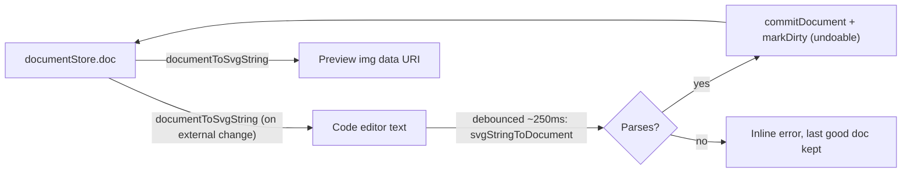
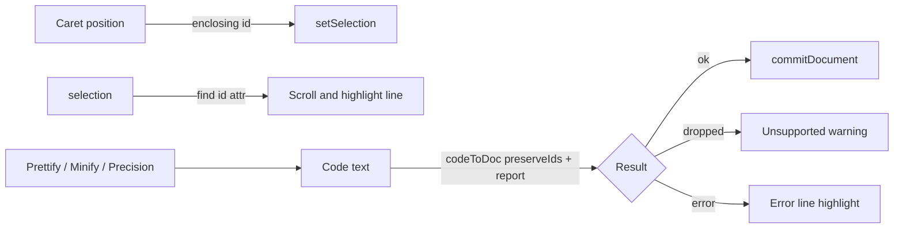

# Live SVG Code mode

## How it works

- **Doc to code:** when Code mode opens, and whenever `doc` changes for any reason other than the panel's own commit (for example undo/redo or a file open), the text gets regenerated with `documentToSvgString(doc)` from [src/shared/document/serialize.ts](src/shared/document/serialize.ts). A ref holds the last doc the panel committed. If the incoming `doc` matches it, the panel leaves your text and cursor alone.
- **Code to doc:** typing goes through a debounce and then `svgStringToDocument` from [src/shared/document/deserialize.ts](src/shared/document/deserialize.ts). That function already rejects hostile SVG and throws `"Invalid SVG"`. If the parse succeeds, the panel calls `useDocumentStore.getState().commitDocument(next)` and then `useUiStore.getState().markDirty()`. `commitDocument` already skips no-op changes and records undo history through zundo.
- **Keep document identity:** `svgStringToDocument` creates a brand-new document named "Converted". Before committing, copy over the current doc's `name`, plus any non-visual fields the SVG text can't carry. I'll check which ones by reading `SvgDocument` in [src/shared/document/types.ts](src/shared/document/types.ts).
- **Preview:** render `documentToSvgString(doc)` as an ``, which keeps scripts sandboxed. Because the preview reflects what the document actually holds, any element the import drops disappears from the preview right away. That's the honest behavior for two-way sync. The preview gets a checkerboard background, plus a toolbar with Fit/100% zoom and a light/dark background toggle like svgviewer's.
- **Errors:** a status strip under the editor shows either "Synced" or the parse error message. The canvas keeps the last good state.

## Additions

### Report what the import drops
- Add an optional `report?: { dropped: Map<string, number> }` argument to `svgStringToDocument`, passed down through `ingestElement` in [src/shared/document/deserialize.ts](src/shared/document/deserialize.ts). Two kinds of element get recorded:
  - Unknown tags that fall through to the recurse-into-children branch.
  - `SKIP_TAGS` hits that aren't used up as paint servers, such as `<style>`, `<filter>`, and `<use>`. Gradients, `<defs>`, and `<clipPath>` that the importer resolves don't count.
- The status strip shows a warning such as "Not supported, removed: 2 x `<filter>`, 1 x `<style>`". The commit still goes through, so the preview shows the actual result.
- Existing callers (the converter and file open) don't change, because the argument is optional.

### Error location
- `codeToDoc` reads the `parsererror` element's text. Chromium/WebView2 and jsdom both report something like "line 14 at column 3". The function returns `{ ok: false, error, line?, column? }`.
- The editor highlights that line in the gutter, and a "Go to line" link in the status strip moves the textarea caret there with `setSelectionRange`.
- The hostile-source rejections from `rejectHostileSvgSource` don't carry a line number; their messages are shown as they are.

### Linked selection
- **Stable IDs (needed first):** `baseFromEl` currently assigns a new `nanoid(10)` to every imported node, so every code commit would renumber all nodes and clear the selection. Add an opt-in `preserveIds` flag that reuses the element's `id` attribute when it is non-empty, unique within the parse, and passes the same character check the project validator uses. Only `codeToDoc` turns it on, so other imports behave as before.
- **Code to canvas:** on caret movement (`select`/`click`/`keyup`), find the innermost element tag around the caret offset whose `id` exists in `doc.nodes`, then call `setSelection([id])`. A small tag scanner over the text is enough, because the panel's own serializer generates that text.
- **Canvas to code:** when `selection` changes from outside the panel (another tool, or the Layers panel if it's visible), find `id="<nodeId>"` in the text and scroll that line into view, with a highlight band in the gutter. The caret doesn't move.
- Selection persists across the mode switch, so selecting in Edit and then opening Code jumps straight to that element.

### Optimize and prettify
- New `src/features/code/svgFormat.ts`, made of pure functions:
  - `prettify(text)`: reindents via `DOMParser` and `XMLSerializer` with two-space nesting.
  - `minify(text)`: removes whitespace between tags.
  - `roundNumbers(text, precision)`: rounds numbers inside `d`, `points`, `transform`, and numeric attributes, for precision values from 0 to 4.
- The editor toolbar gets Prettify, Minify, and a Precision select. Each one rewrites the text, which then goes through the normal debounced commit, so it can be undone.
- The status strip shows the size as `N bytes`, plus `before -> after (-x%)` after an optimize action.

### Data flow with additions

## Changes

- [src/shared/stores/uiStore.ts](src/shared/stores/uiStore.ts): extend `AppMode` to `"convert" | "edit" | "code"`.
- [src/app/layout/Toolbar.tsx](src/app/layout/Toolbar.tsx): add a third `Code` tab to `.mode-switch`.
- [src/app/layout/AppShell.tsx](src/app/layout/AppShell.tsx): in `<main>`, render `<CodeView />` when `mode === "code"`. The right panel stays edit-only, and the existing grid column logic already collapses it.
- [src/shared/ui/commands.ts](src/shared/ui/commands.ts) and `runCommand` in `AppShell`: add an "Open SVG code" palette command that calls `setMode("code")`.
- New `src/features/code/CodeView.tsx`: lays out the editor and preview using the existing [src/shared/ui/SplitPane.tsx](src/shared/ui/SplitPane.tsx).
- New `src/features/code/CodeEditor.tsx`: a monospace `<textarea>` with a scroll-synced line-number gutter. Tab inserts two spaces, and spellcheck is turned off. Keystrokes stay out of the global shortcuts because `isTypingTarget` already covers textareas. No new dependencies; CodeMirror could come later for syntax highlighting.
- New `src/features/code/codeSync.ts`: pure helpers, `docToCode(doc)` and `codeToDoc(text, current): { ok: true, doc } | { ok: false, error }`, so they can be tested without React.
- New `src/features/code/codeSync.test.ts`: covers round-tripping a simple doc, invalid SVG returning an error with a line number, doc name preservation, a no-op edit not changing project contents, node IDs staying stable across an edit, duplicate or invalid `id` attributes falling back to new IDs, and dropped-tag counts.
- New `src/features/code/svgFormat.test.ts`: checks that prettify and minify leave the parsed document unchanged, and that rounding precision applies only to numeric attributes.
- New `src/features/code/caretElement.ts` and `caretElement.test.ts`: map a caret offset to the enclosing element `id`, and an `id` to a line number.
- Extend [src/shared/document/deserialize.test.ts](src/shared/document/deserialize.test.ts): the default import still generates new IDs, and `preserveIds` reuses valid ones.
- [USER_MANUAL.md](USER_MANUAL.md): a short "Code mode" section. Regenerating the PDF is optional, using `pnpm manual:pdf`.

## Verification

- `pnpm test` and `pnpm build` (which includes `tsc --noEmit`).
- Manual check in `pnpm dev`: draw a rect in Edit, switch to Code, change its `fill`, and confirm the preview updates within about 250ms. Then undo with Ctrl+Z and confirm the code text regenerates. Finally type broken markup and confirm the error strip appears while the canvas stays unchanged.
- Additional manual checks:
  - Paste an SVG containing `<filter>` and confirm the unsupported warning appears.
  - Click inside a `<rect>` tag in the code, switch to Edit, and confirm that rect is selected.
  - Select a shape in Edit, switch to Code, and confirm its line is highlighted.
  - Run Precision 1, confirm the byte count drops, and confirm Ctrl+Z restores the original.
