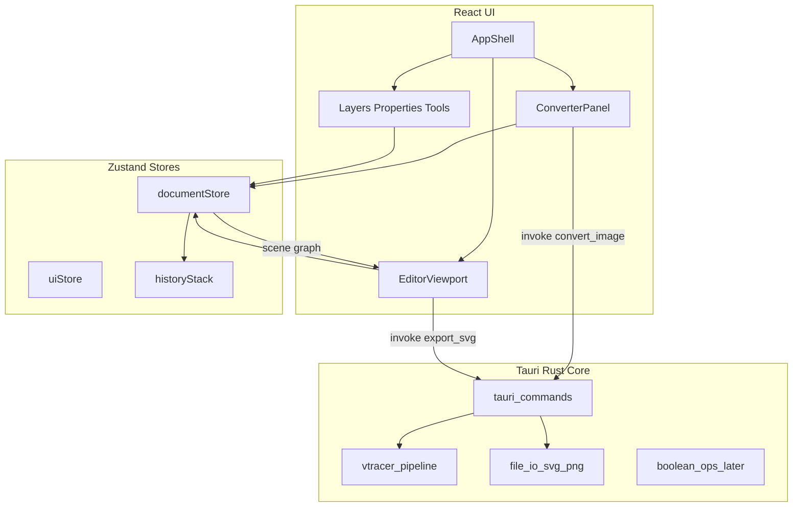

# SaVaGe — Desktop Image→SVG Converter + Full SVG Editor

## Locked decisions

| Decision | Choice |
|---|---|
| Product name | **SaVaGe** (SVG + Savage) |
| Platform | **Desktop**, Windows first (Tauri also supports macOS/Linux later) |
| Shell | **Tauri 2** (Rust host, system WebView) |
| UI | **React 19 + TypeScript + Vite** |
| State | **Zustand** (document + UI) + **Immer** for immutable scene updates |
| Undo | **Zundo** or custom command stack on the document store |
| Rendering | Custom **SVG document model** + **HTML Canvas 2D** viewport (hit-test in screen space; export remains real SVG) |
| Vectorization | **Rust crate `vtracer`** (+ `image` crate) behind Tauri commands |
| Styling | CSS variables + custom design system (no Inter/Roboto; expressive fonts via `@fontsource`) |
| Package manager | **pnpm** for frontend; **Cargo** for Rust |
| Scope mode | **Full roadmap (A)** — ship in phases; each phase is independently runnable |

Workspace root: `c:\Users\s_sme\VS_Code_Project\SaVaGe` (currently empty).

---

## Architecture (target)



**Document model rule:** The source of truth is a typed scene graph (`SvgDocument`), not raw SVG strings while editing. Raw SVG is only for import/export and clipboard.

---

## Phase 0 — Repo bootstrap (Day 1)

Goal: empty folder becomes a runnable Tauri + React app titled “SaVaGe”.

### 0.1 Prerequisites (human / agent checklist)

Install if missing:

- Node.js 22 LTS
- pnpm (`npm i -g pnpm`)
- Rust stable (`rustup`)
- Visual Studio Build Tools (Windows: C++ workload) for Tauri
- WebView2 (usually present on Win10/11)

### 0.2 Create project

From `c:\Users\s_sme\VS_Code_Project\SaVaGe`:

```powershell
pnpm create tauri-app . --template react-ts --manager pnpm --yes
```

If the directory-nonempty guard fails, create in a temp subfolder and move files up, or scaffold manually:

- `package.json`, `vite.config.ts`, `tsconfig.json`, `index.html`, `src/`, `src-tauri/`

### 0.3 Pin versions (write exactly)

**`package.json` scripts:**

```json
{
  "name": "savage",
  "private": true,
  "type": "module",
  "scripts": {
    "dev": "vite",
    "build": "tsc -b && vite build",
    "preview": "vite preview",
    "tauri": "tauri",
    "tauri:dev": "tauri dev",
    "tauri:build": "tauri build"
  }
}
```

Install frontend deps:

```powershell
pnpm add zustand immer zundo nanoid clsx
pnpm add @fontsource-variable/syne @fontsource-variable/dm-sans
pnpm add -D @tauri-apps/cli @types/node
pnpm add @tauri-apps/api @tauri-apps/plugin-dialog @tauri-apps/plugin-fs @tauri-apps/plugin-shell
```

### 0.4 Rust crate setup (`src-tauri/Cargo.toml`)

Add dependencies:

```toml
[dependencies]
tauri = { version = "2", features = [] }
tauri-plugin-dialog = "2"
tauri-plugin-fs = "2"
serde = { version = "1", features = ["derive"] }
serde_json = "1"
image = { version = "0.25", default-features = false, features = ["png", "jpeg", "gif", "webp", "bmp", "tiff"] }
vtracer = "0.6"
anyhow = "1"
thiserror = "2"
```

(Adjust `vtracer` version to latest compatible on crates.io at implement time.)

### 0.5 First run gate

```powershell
pnpm tauri:dev
```

Pass criteria: window opens, blank React root renders “SaVaGe”.

### 0.6 Folder layout (create all empty modules now)

```
src/
  main.tsx
  app/App.tsx
  app/theme.css
  app/layout/
    AppShell.tsx
    TitleBar.tsx          # custom frameless chrome optional later
    Toolbar.tsx
    StatusBar.tsx
  features/
    converter/
    editor/
    layers/
    properties/
    tools/
  shared/
    document/
      types.ts
      serialize.ts
      deserialize.ts
      emptyDocument.ts
    stores/
      documentStore.ts
      uiStore.ts
    geometry/
      bounds.ts
      transform.ts
      hitTest.ts
      path.ts
    ui/
      Button.tsx
      IconButton.tsx
      Panel.tsx
      Slider.tsx
      ColorSwatch.tsx
      SplitPane.tsx
  assets/
src-tauri/
  src/
    lib.rs
    main.rs
    commands/
      mod.rs
      convert.rs
      export.rs
      import.rs
    vectorize/
      mod.rs
      pipeline.rs
      presets.rs
```

---

## Phase 1 — Design system + professional UI shell

Goal: the first viewport looks like a branded creative tool, not a generic dashboard.

### 1.1 Visual direction (locked)

- **Mood:** dark graphite studio with electric lime accent (not purple, not cream-serif)
- **Display font:** Syne Variable (logo / hero labels)
- **UI font:** DM Sans Variable
- **Background:** deep `#0B0D10` with subtle radial vignette + faint noise SVG overlay
- **Accent:** `#B8FF3C`
- **Danger / warn:** `#FF5C5C` / `#FFC14A`
- **Surfaces:** `#12151A`, `#1A1F27`, hairline borders `rgba(255,255,255,0.08)`

Write CSS variables in [`src/app/theme.css`](src/app/theme.css):

```css
:root {
  --bg-0: #0B0D10;
  --bg-1: #12151A;
  --bg-2: #1A1F27;
  --fg-0: #F2F4F7;
  --fg-1: #A7B0BD;
  --accent: #B8FF3C;
  --accent-ink: #0B0D10;
  --border: rgba(255,255,255,0.08);
  --radius: 10px;
  --font-display: "Syne Variable", sans-serif;
  --font-ui: "DM Sans Variable", sans-serif;
}
```

### 1.2 Motion (minimum 3)

1. App shell panels slide/fade in 180ms on mount (`transform` + `opacity`).
2. Tool selection: accent underline scales with `transform: scaleX`.
3. Converter progress: indeterminate bar with shimmer keyframes.

### 1.3 `AppShell` layout (exact regions)

```
+--------------------------------------------------+
| TitleBar / menu: File Edit Object View Help      |
+------+-----------------------------------+---+---+
| Tools|           Viewport / Converter       | L |
| rail |                                      | a |
|      |                                      | y |
|      |                                      | e |
+------+--------------------------------------+ r |
| Status: zoom | selection | mode | perf ms   | s |
+----------------------------------------------+---+
```

Right column also hosts **Properties** under Layers via tabs.

### 1.4 Files to implement

| File | Responsibility |
|---|---|
| `AppShell.tsx` | CSS grid shell; hosts children |
| `Toolbar.tsx` | mode switch: Convert \| Edit |
| `StatusBar.tsx` | zoom, FPS/frame time, selection count |
| `Panel.tsx` | titled panel chrome |
| `uiStore.ts` | `mode`, `activeTool`, `rightTab`, `zoom`, `pan`, `showGrid`, `snap` |

### 1.5 Pass criteria

- Looks branded with **SaVaGe** as hero-level wordmark in Convert mode landing
- No Inter/system-default look
- Responsive down to ~1280×720 usable

---

## Phase 2 — SVG document model (foundation for editor + converter)

Goal: one typed scene graph drives both converter output and editor.

### 2.1 Types — write in [`src/shared/document/types.ts`](src/shared/document/types.ts)

Implement exactly these interfaces (expand fields as phases need them):

```ts
export type NodeId = string;

export type BlendMode = "normal" | "multiply" | "screen" | "overlay";

export interface Transform2D {
  x: number; y: number;
  rotation: number; // degrees
  scaleX: number; scaleY: number;
  skewX: number; skewY: number;
}

export interface SolidPaint { type: "solid"; color: string; opacity: number }
export interface GradientStop { offset: number; color: string; opacity: number }
export interface LinearGradientPaint {
  type: "linear"; x1: number; y1: number; x2: number; y2: number; stops: GradientStop[];
}
export type Paint = SolidPaint | LinearGradientPaint | { type: "none" };

export interface StrokeStyle {
  paint: Paint;
  width: number;
  lineCap: "butt" | "round" | "square";
  lineJoin: "miter" | "round" | "bevel";
  miterLimit: number;
  dashArray: number[];
  dashOffset: number;
  align: "center" | "inside" | "outside"; // outside/inside approximated later
}

export interface PathPoint {
  id: NodeId;
  x: number; y: number;
  handleIn?: { x: number; y: number };  // absolute
  handleOut?: { x: number; y: number };
  type: "corner" | "smooth" | "symmetric";
}

export interface PathSubpath {
  closed: boolean;
  points: PathPoint[];
}

export type SceneNode =
  | GroupNode
  | PathNode
  | RectNode
  | EllipseNode
  | LineNode
  | TextNode
  | ImageNode;

export interface NodeBase {
  id: NodeId;
  name: string;
  visible: boolean;
  locked: boolean;
  opacity: number;
  blendMode: BlendMode;
  transform: Transform2D;
}

export interface GroupNode extends NodeBase {
  type: "group";
  children: NodeId[];
}

export interface PathNode extends NodeBase {
  type: "path";
  subpaths: PathSubpath[];
  fill: Paint;
  stroke: StrokeStyle;
  fillRule: "nonzero" | "evenodd";
}

export interface RectNode extends NodeBase {
  type: "rect";
  width: number; height: number;
  rx: number; ry: number;
  fill: Paint; stroke: StrokeStyle;
}

export interface EllipseNode extends NodeBase {
  type: "ellipse";
  rx: number; ry: number;
  fill: Paint; stroke: StrokeStyle;
}

export interface LineNode extends NodeBase {
  type: "line";
  x2: number; y2: number;
  stroke: StrokeStyle;
}

export interface TextNode extends NodeBase {
  type: "text";
  content: string;
  fontFamily: string;
  fontSize: number;
  fontWeight: number;
  letterSpacing: number;
  lineHeight: number;
  fill: Paint; stroke: StrokeStyle;
}

export interface ImageNode extends NodeBase {
  type: "image";
  href: string; // asset id or data URL
  width: number; height: number;
}

export interface SvgDocument {
  version: 1;
  name: string;
  width: number;
  height: number;
  viewBox: { x: number; y: number; w: number; h: number };
  background: string | null;
  rootChildIds: NodeId[];
  nodes: Record<NodeId, SceneNode>;
  assets: Record<string, { mime: string; dataBase64: string }>;
}
```

### 2.2 Helpers

| File | Functions |
|---|---|
| `emptyDocument.ts` | `createEmptyDocument(w=1920,h=1080)` |
| `serialize.ts` | `documentToSvgString(doc): string` — walks nodes, emits SVG |
| `deserialize.ts` | `svgStringToDocument(svg): SvgDocument` — parse via `DOMParser` in WebView |
| `documentStore.ts` | Zustand store: `doc`, `selection: NodeId[]`, actions below |

### 2.3 Store actions (implement all stubs now)

- `loadDocument(doc)`
- `replaceFromSvg(svg: string)`
- `setSelection(ids)`
- `addNode(node, parentId?)`
- `updateNode(id, patch)`
- `deleteNodes(ids)`
- `reorderInParent(id, index)`
- `groupSelection()` / `ungroup(id)`
- `setNodeTransform(id, t)`
- History: wrap mutating actions with zundo `temporal` middleware

### 2.4 Pass criteria

Unit-test (Vitest) round-trip: empty doc → add rect → serialize → deserialize → equal structure (ignore generated ids if remapped).

---

## Phase 3 — High-quality image → SVG converter (core product #1)

Goal: any common raster → clean, editable SVG paths loaded into the document.

### 3.1 Supported inputs

Via `image` crate decode: PNG, JPEG, GIF, WEBP, BMP, TIFF. (SVG pass-through import is Phase 4.)

### 3.2 Tauri command API

In [`src-tauri/src/commands/convert.rs`](src-tauri/src/commands/convert.rs):

```rust
#[derive(Deserialize)]
pub struct ConvertOptions {
  pub color_precision: u8,      // 1..=8  (vtracer)
  pub filter_speckle: u8,       // 0..=16
  pub splice_threshold: u8,     // degrees-ish
  pub corner_threshold: u8,
  pub path_precision: u8,       // decimal places
  pub mode: String,             // "spline" | "polygon" | "pixel"
  pub hierarchical: String,     // "stacked" | "cutout"
  pub layer_difference: i32,
}

#[tauri::command]
pub fn convert_image_to_svg(
  path: String,
  options: ConvertOptions,
) -> Result<String, String>
```

### 3.3 Pipeline (`vectorize/pipeline.rs`) — step by step

1. Read bytes from `path`.
2. `image::open` → convert to RGBA8.
3. Optional pre-process (implement as flags):
   - Max dimension clamp (e.g. longest side 2048) for performance
   - Optional Gaussian blur (small sigma) to reduce noise before trace
4. Call `vtracer::convert` / `ColorImage` APIs with mapped options.
5. Return SVG string.
6. Frontend: `svgStringToDocument` → `loadDocument` → switch UI mode to `edit`.

### 3.4 Presets (`presets.rs` + UI)

| Preset | Intent | Option defaults |
|---|---|---|
| Logo / flat | crisp shapes, few colors | low filter_speckle=4, color_precision=6, spline |
| Photo / posterized | more colors | color_precision=5, filter_speckle=8 |
| Line art | B/W emphasis | posterize toward 2 colors OR threshold pre-pass |
| Pixel perfect | mode=polygon/pixel | for pixel art |

### 3.5 Converter UI (`features/converter/`)

Files:

- `ConverterView.tsx` — full-bleed drop zone as hero visual (user’s image is the atmosphere)
- `DropZone.tsx` — drag/drop + click open dialog (`@tauri-apps/plugin-dialog`)
- `ConvertOptionsForm.tsx` — sliders bound to options
- `ConvertPreview.tsx` — side-by-side raster vs SVG preview (object-fit contain)
- `convertApi.ts` — `invoke("convert_image_to_svg", { path, options })`

### 3.6 Quality bar (acceptance tests)

Create `testdata/` with:

1. flat logo PNG
2. photo JPEG
3. line-art PNG
4. transparent WEBP

For each, convert with Logo / Photo / Line presets; manually verify:

- Paths are editable nodes (not a single embedded raster)
- Speckle noise low on Logo preset
- Transparent areas not filled with opaque rectangles

### 3.7 Performance

- Run conversion on Rust side (not JS).
- Show progress UI (indeterminate until command returns).
- Cancel: use `tauri::async_runtime` + CancellationToken in a later polish; v1 can disable UI controls while running.

### 3.8 Pass criteria

User can open any supported image, convert, and immediately edit paths in the editor viewport (even if editor tools are still limited to select/pan).

---

## Phase 4 — Editor viewport core (high performance)

Goal: 60fps pan/zoom/select on documents with thousands of path segments.

### 4.1 Rendering strategy (locked)

- **Display:** single `<canvas>` covering the viewport.
- **Camera:** `{ zoom, panX, panY }` in `uiStore`.
- **Frame loop:** `requestAnimationFrame` only when dirty (set dirty on doc/camera/selection/hover changes).
- **Layers of draw:** grid → nodes back-to-front → selection outlines → handles → snap guides.

### 4.2 Files

| File | Role |
|---|---|
| `EditorViewport.tsx` | canvas ref, pointer events, rAF |
| `renderer/drawDocument.ts` | walk `rootChildIds`, draw nodes |
| `renderer/drawPath.ts` | path → Path2D |
| `renderer/drawHandles.ts` | bbox + anchors |
| `geometry/path.ts` | `subpathsToPath2D`, `pointInPath`, `bezierBounds` |
| `geometry/hitTest.ts` | top-most node under pointer |
| `geometry/transform.ts` | matrix multiply, apply to points |

### 4.3 Pointer tools (v1)

Implement tool interface:

```ts
interface Tool {
  id: string;
  onPointerDown(e: ToolEvent): void;
  onPointerMove(e: ToolEvent): void;
  onPointerUp(e: ToolEvent): void;
  onKeyDown?(e: KeyboardEvent): void;
}
```

Tools in Phase 4:

- `select` — click select, shift multi, drag move, bbox resize handles (8), rotate handle
- `pan` — space+drag or middle mouse
- `zoom` — wheel zoom to cursor; ctrl+wheel

### 4.4 Hit-testing

1. Convert screen → world: `((sx - panX) / zoom, (sy - panY) / zoom)`
2. Iterate nodes front-to-back (reverse paint order)
3. For paths: `isPointInPath` with fill + stroke width tolerance `/ zoom`
4. Skip `locked` / `!visible`

### 4.5 Selection chrome

- Blue/accent bounding box in **screen space** (stroke width constant 1px)
- Move updates `transform.x/y` OR bakes into path points for paths (prefer transform on node for perf; bake on export if needed)

### 4.6 Keyboard

- `Delete` / `Backspace` delete selection
- `Ctrl+Z` / `Ctrl+Shift+Z` undo/redo
- `Ctrl+A` select all
- `Ctrl+D` duplicate
- Arrows nudge 1px (Shift=10)

### 4.7 Pass criteria

- Smooth pan/zoom on converted photo SVGs
- Select/move/resize/rotate work
- Undo restores prior transforms

---

## Phase 5 — Layers + properties panels

### 5.1 Layers panel

- Tree from `rootChildIds` + group children
- Visibility eye / lock icons
- Drag reorder → `reorderInParent`
- Double-click rename
- Indent for groups

### 5.2 Properties panel (context-sensitive)

For selection:

- X, Y, W, H, R
- Opacity, blend mode
- Fill color picker + opacity
- Stroke color, width, dash
- For text: font size/family (basic)

Use controlled inputs that commit on blur/Enter to keep undo coarse-grained.

---

## Phase 6 — Shape + pen + pencil tools

### 6.1 Shape tools

- Rectangle, Ellipse, Line, Polygon (n-gon), Star
- Drag to create; Shift constrains aspect; Alt from center

### 6.2 Pen tool (Bezier)

State machine:

1. first click → start subpath
- click → corner point
- click-drag → smooth point with handles
- click on first point → close path
- Enter / Esc → finish open path
- Backspace → remove last point while drawing

### 6.3 Pencil / freehand

- Sample pointer points with spacing threshold
- Fit cubic beziers (implement Ramer–Douglas–Peucker then cubic fit, or use simplify-js + custom fit)
- Result = `PathNode`

### 6.4 Node editing tool (`directSelect`)

- Show anchors + handles for selected paths
- Drag anchor; drag handles
- Alt-break handles; convert corner↔smooth
- Add/remove anchors on segment click / selected+Delete

---

## Phase 7 — Boolean ops, align, path ops

### 7.1 Align / distribute (JS)

Align left/center/right/top/middle/bottom relative to selection bounds or artboard.

### 7.2 Boolean (Rust recommended for perf)

Add crate `i_overlay` or `flo_curves` / path boolean library; expose:

`boolean_op(svg_paths, op: union|intersect|subtract|exclude) -> path data`

Fallback if crate friction: use `paper.js` boolean in worker (slower; acceptable interim).

### 7.3 Path ops

- Unite / Intersect / Subtract / Exclude
- Outline stroke (stroke → filled path) — later phase OK
- Simplify path
- Flatten curves to lines (export option)

---

## Phase 8 — Fills, gradients, appearance

- Linear gradients (UI + serialize)
- Radial gradients
- Multiple fills/strokes per object (appearance stack) — store as arrays when extending types
- Drop shadow / blur as SVG filters (`<filter>`) — serialize correctly
- Clip masks / opacity masks
- Symmetry / repeat — backlog unless time

---

## Phase 9 — Typography

- Editable text nodes on canvas (double-click)
- Font enumeration via system fonts plugin or bundled fonts first
- Point text vs area text
- Convert text to outlines (Rust `ttf-parser` + glyphy path extraction, or canvas measure + deferred)

---

## Phase 10 — File IO, clipboard, export

### 10.1 Formats

| Action | Format |
|---|---|
| Open | SVG, + raster opens Converter |
| Save | `.savage` JSON of `SvgDocument` (project) |
| Export | SVG, PNG, PDF (PDF later via print/SVG) |
| Copy/Paste | internal JSON + `image/svg+xml` |

### 10.2 Commands

- `read_text_file` / `write_text_file` via plugin-fs
- `export_png` — render SVG to pixmap in Rust (`resvg` + `tiny-skia`) — add deps when reaching this phase

---

## Phase 11 — Feature parity roadmap (Illustrator / Inkscape class)

Implement in this order after Phase 10; each item is a milestone with its own PR:

1. Artboards (multiple)
2. Symbols / components
3. Shape builder
4. Live boolean preview
5. Mesh gradients
6. Variable width strokes
7. Brushes (calligraphy, pattern, scatter)
8. Perspective grid
9. Graph / chart tools — skip (out of brand)
10. Plugins API
11. CMYK / print bleed — optional
12. Collaboration — out of scope for desktop v1

**Definition of “leading editor features” for SaVaGe v1.0 exit:** Phases 3–10 complete + Phase 11 items 1–7.

---

## Performance rules (enforce every phase)

1. Never parse full SVG DOM each frame — only scene graph.
2. Dirty-flag rendering only.
3. Spatial index (quadtree) when node count > 500 — add in Phase 4 polish.
4. Heavy work (convert, boolean, export PNG) in Rust.
5. Avoid React re-renders on pointer move — tools mutate refs / store with throttled UI updates (16ms) for property fields.

---

## Testing strategy

| Layer | Tool | What |
|---|---|---|
| Unit | Vitest | geometry, serialize round-trip |
| Rust | `cargo test` | convert presets smoke tests with `testdata` |
| E2E manual | checklist.md | open → convert → edit → export |
| Perf | StatusBar ms | pan/zoom frame time &lt; 16ms on mid laptop |

---

## Implementation order for the coding agent

Execute **strictly in phase order**. Do not start Phase N+1 UI until Phase N pass criteria met.

**Sprint mapping (suggested):**

| Sprint | Phase |
|---|---|
| S0 | Phase 0 bootstrap |
| S1 | Phase 1 UI shell |
| S2 | Phase 2 document model |
| S3 | Phase 3 converter |
| S4 | Phase 4 viewport core |
| S5 | Phase 5 panels |
| S6 | Phase 6 drawing tools |
| S7 | Phase 7 booleans/align |
| S8 | Phase 8 appearance |
| S9 | Phase 9 text |
| S10 | Phase 10 IO/export |
| S11+ | Phase 11 parity items |

---

## Concrete first files the agent should write after approve

1. Scaffold Tauri React TS app
2. `theme.css` + fonts + `AppShell`
3. `types.ts` + `emptyDocument` + `documentStore`
4. Rust `convert_image_to_svg`
5. `ConverterView` wired to invoke
6. Minimal canvas `EditorViewport` that paints converted paths

That sequence yields a demoable product early (convert + select/move), then deepens editor parity phase by phase.
